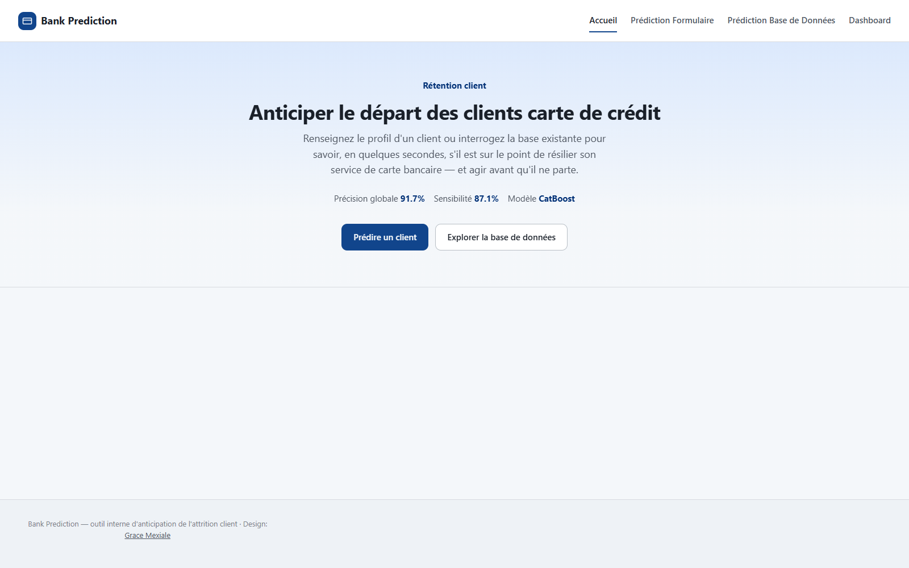

# Bank Prediction — Anticipation de l'attrition carte de crédit

Application web qui prédit si un client va résilier ("attrition") son service de carte de crédit bancaire, à partir de quelques variables client (âge, ancienneté produits, inactivité, solde, transactions, taux d'utilisation). Destinée aux équipes relation client / rétention (chargés de clientèle, analystes marketing) pour obtenir un signal de risque immédiat et actionnable, compréhensible en quelques secondes sans expertise data science.

🔗 **Site en ligne : [bank-credit-card.onrender.com](https://bank-credit-card.onrender.com/)**

> Hébergé sur le free tier Render : l'instance se met en veille après inactivité, le premier chargement peut donc prendre 30-60 secondes le temps qu'elle se réveille.



## Fonctionnalités

- **Prédiction unitaire** (`/Predic_form`) — formulaire de saisie d'un client, résultat immédiat avec un score de risque 0-100, un niveau qualitatif (Faible / Moyen / Élevé / Critique) et les principaux facteurs explicatifs ("Pourquoi ?") calculés avec SHAP.
- **Prédiction en lot** (`/Predic_BD`) — tire un échantillon aléatoire de clients dans la base et affiche statut réel vs. statut prédit côte à côte, pour scanner rapidement un portefeuille.
- **API JSON** (`/predict_api`) — même prédiction unitaire, réponse JSON, pour intégration externe.
- **Dashboard portefeuille** (`/dashboard`) — vue d'ensemble sur l'ensemble de la base : taux d'attrition historique, risque moyen prédit, top 10 clients à risque, taux de churn par tranche d'âge et par genre.

## Modèle

Le modèle actif (`model.pkl`) est choisi automatiquement parmi cinq candidats (Régression Logistique, Random Forest, XGBoost, LightGBM, CatBoost) plus un ensemble Stacking, entraînés et évalués sur `Db.sqlite3` par `train_model.py`. Le vainqueur est sélectionné sur le F1-score de la classe "Attrited" (plutôt que l'accuracy brute), car la base est déséquilibrée (~16 % de clients attrités).

Dernier entraînement (`model_metrics.json`) :

| Modèle retenu | Accuracy | Précision | Rappel (sensibilité) | F1 | ROC-AUC |
|---|---|---|---|---|---|
| CatBoost | 91.7 % | 69.0 % | 87.1 % | 77.0 % | 96.0 % |

Ré-entraîner après toute modification de `Db.sqlite3` :

```bash
env311/Scripts/python.exe train_model.py
```

## Stack technique

Python 3.11 · Flask · scikit-learn · XGBoost / LightGBM / CatBoost · SHAP (explicabilité) · pandas / numpy · SQLite · Chart.js (dashboard) · gunicorn (production)

## Installation

```bash
python -m venv env311
env311/Scripts/activate        # Windows
pip install -r requirements.txt
```

## Lancer l'application

```bash
python wsgi.py
```

L'application démarre en local sur http://127.0.0.1:5000.

> Pas de rechargement à chaud des templates HTML (l'app tourne avec `debug=False`) : redémarrer le process après toute modification d'un fichier `.html`. Les fichiers `.css`/`.js` statiques sont en revanche servis frais à chaque requête.

## Déploiement

L'app est prête pour un déploiement continu sur [Render](https://render.com) via le Blueprint `render.yaml` à la racine : chaque push sur `main` déclenche un déploiement automatique (build `pip install -r requirements.txt`, démarrage `gunicorn wsgi:app --preload --workers 2`).

Pour l'activer : sur Render, **New +** → **Blueprint**, connecter le repo GitHub `Mexiale/Bank_credit_card`, valider — Render détecte `render.yaml` automatiquement.

En production sans passer par Render, la commande de démarrage (`Procfile`) est :

```
gunicorn wsgi:app --preload --workers 3
```

## Architecture

Voir [CLAUDE.md](CLAUDE.md) pour le détail des routes, du pipeline de features, du système d'explicabilité SHAP et de la structure des templates. Voir [PRODUCT.md](PRODUCT.md) pour les principes produit et design.

Aucune suite de tests automatisés n'est présente à ce jour.
